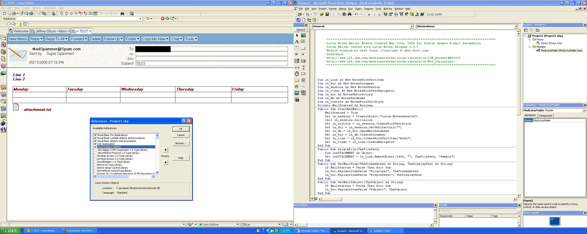



## Lotus Notes Mailer Module

### Description

Create New Lotus Mail, Add Rich Text Lines, Tables, Attachments, Change Who sent the e-mail using the Lotus Domino Object.

What I've got works for me and should work for my project. I figure I better upload it now else I'll forget and it will never happen.

I hope it will help you out and hopefully it works

with other version of Lotus Notes.

If you experience any problems please let me know and I'll try and update.
 
### More Info
 
on the form make sure you change the SentTo Address line.

You must have Lotus notes and if you use the module make sure you reference the Lotus Domino Objects

When changing the senders name, the senders name stil shows up on the BlackBerry but for Lotus Notes it appears to be visually masked.

             |
---                |---
**Submitted On**   |2006-05-17 19:30:48
**By**             |[OberCanober](https://github.com/Planet-Source-Code/PSCIndex/blob/master/ByAuthor/obercanober.md)
**Level**          |Intermediate
**User Rating**    |5.0 (10 globes from 2 users)
**Compatibility**  |VB 6\.0
**Category**       |[OLE/ COM/ DCOM/ Active\-X](https://github.com/Planet-Source-Code/PSCIndex/blob/master/ByCategory/ole-com-dcom-active-x__1-29.md)
**World**          |[Visual Basic](https://github.com/Planet-Source-Code/PSCIndex/blob/master/ByWorld/visual-basic.md)
**Archive File**   |[Lotus\_Note1994905172006\.zip](https://github.com/Planet-Source-Code/obercanober-lotus-notes-mailer-module__1-65385/archive/master.zip)

